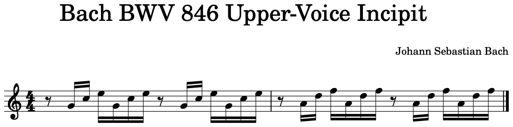
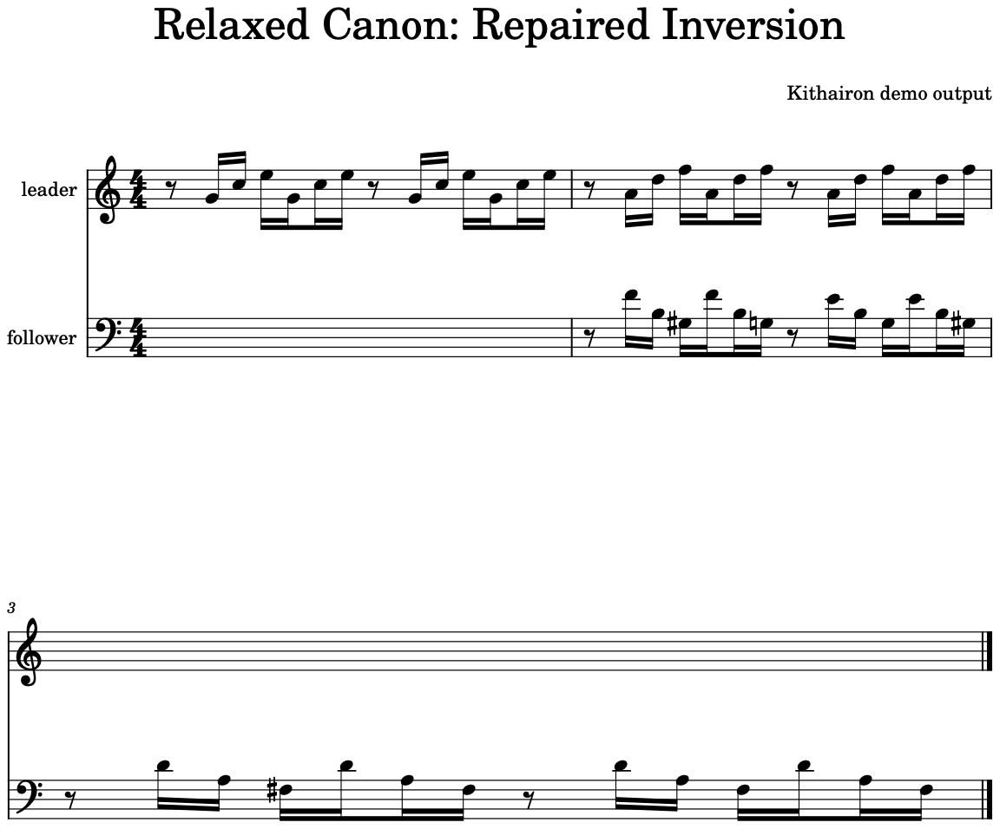
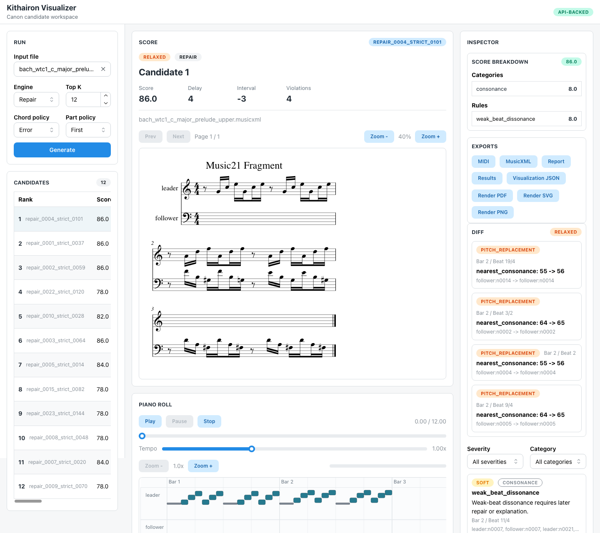
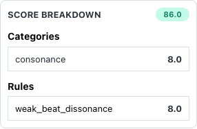

# Kithairon

Kithairon is a small symbolic music compiler that turns a monophonic melody into several playable canon variants. It uses explicit canon transformations to guarantee strict canon candidates, then applies explainable harmony and voice-leading rules to score them. When strict candidates are weak, optional repair and CP-SAT solver engines can produce relaxed canon variants while preserving a clear link to the original melody.

Use it from the `canonize` CLI with MIDI or MusicXML input. Each generation run writes playable files, a machine-readable result file, the resolved config, and a Markdown report.

## 30-Second Demo

Run Kithairon on a longer Bach-derived MusicXML fragment:

```bash
uv run canonize generate examples/melodies/bach_wtc1_c_major_prelude_upper.musicxml \
  --out tmp/demo \
  --engine repair \
  --top-k 12
```

The input is a two-measure monophonic incipit derived from the public-domain BWV 846 entry shipped in the music21 corpus. The generated output includes playable canon candidates with:

- `tmp/demo/candidates/*.musicxml`: a score you can open in a notation editor.
- `tmp/demo/candidates/*.mid`: a playable MIDI file.
- `tmp/demo/report.md`: the score summary and rule penalties.
- `tmp/demo/visualization.json`: data for the web visualization.

The preview below uses the rank 1 repair candidate from this run: repaired inversion, delay 4, score 86.0. In an external listening pass over the main demo candidates, this was the most pleasant clip even though a stricter transposition candidate scored higher under Kithairon's rule penalties.





Listen to the selected candidate: [MP3](docs/assets/demo/output-repair-inversion-delay4.mp3) or [MIDI](docs/assets/demo/output-repair-inversion-delay4.mid).

To inspect the same run in the browser, start the visualization API and frontend as described in [Visualization](docs/visualization.md), then upload `examples/melodies/bach_wtc1_c_major_prelude_upper.musicxml`.



The score breakdown view shows the tradeoff: the selected clip sounds better than the best strict fallback, but it still pays weak-beat dissonance penalties under the current scoring model.



Additional preview picks are available in [docs/assets/demo](docs/assets/demo): the best strict fallback, `output-strict-transposition-delay4.*`, and a second strict alternative with a wider delay.

## Requirements

- Python 3.12 or newer
- `uv`

## Install

Install the default package and development dependencies:

```bash
uv sync
```

Install OR-Tools when you want the CP-SAT solver engine:

```bash
uv sync --extra solver
```

Install documentation dependencies only when previewing the MkDocs site:

```bash
uv sync --extra docs
```

## Quickstart

Validate an input melody:

```bash
uv run canonize validate examples/melodies/scale_c_major.musicxml
```

Generate the top three strict canon candidates:

```bash
uv run canonize generate examples/melodies/scale_c_major.musicxml \
  --out tmp/strict \
  --engine strict \
  --top-k 3
```

The output directory contains:

- `results.json`: full candidate data, scores, violations, transforms, and output paths.
- `report.md`: a readable summary of top candidates and penalty reasons.
- `resolved_config.toml`: the exact config used for the run.
- `visualization.json`: normalized data for the web visualization.
- `artifact_index.json`: the safe download map used by the API and web UI.
- `candidates/*.musicxml` and `candidates/*.mid`: playable exports for each candidate.

A successful command returns a compact JSON payload:

```json
{
  "status": "ok",
  "engine": "strict",
  "out": "tmp/strict",
  "candidates": 3,
  "results": "tmp/strict/results.json",
  "report": "tmp/strict/report.md",
  "resolved_config": "tmp/strict/resolved_config.toml",
  "visualization": "tmp/strict/visualization.json",
  "artifact_index": "tmp/strict/artifact_index.json"
}
```

If `--out` already exists and is not empty, Kithairon writes to a suffixed directory such as `tmp/strict-1`. To replace the existing output directory, put `--overwrite` before the subcommand:

```bash
uv run canonize --overwrite generate examples/melodies/scale_c_major.musicxml \
  --out tmp/strict \
  --engine strict
```

## Engine Examples

Strict generation keeps the follower voice as an exact transform of the input melody:

```bash
uv run canonize generate examples/melodies/scale_c_major.musicxml \
  --out tmp/strict \
  --engine strict \
  --top-k 3
```

Repair generation starts from strict candidates and edits a limited number of follower notes when that improves the score:

```bash
uv run canonize generate examples/melodies/bad_for_canon.musicxml \
  --out tmp/repair \
  --engine repair \
  --top-k 3
```

Solver generation uses OR-Tools CP-SAT to search for a relaxed follower voice under edit limits:

```bash
uv sync --extra solver
uv run canonize generate examples/melodies/bad_for_canon.musicxml \
  --out tmp/solver \
  --engine solver \
  --top-k 1
```

Auto generation ranks strict candidates first. If the strict pool falls below the configured quality thresholds, it adds repair candidates. It may add solver candidates when the solver dependency is installed and `[solver].enabled = true` in the resolved config:

```bash
uv run canonize generate examples/melodies/bad_for_canon.musicxml \
  --out tmp/auto \
  --engine auto \
  --top-k 4
```

## Strict And Relaxed Canons

A strict canon has `strict_canon: true` and `canon_label: "strict canon"` in `results.json`. The follower is exactly produced from the source melody by the recorded `transform_spec`, for example transposition, inversion, retrograde, augmentation, or diminution with a delay.

A relaxed canon has `strict_canon: false` and `canon_label: "relaxed canon"`. It still records the source transform and candidate lineage, but the repair or solver engine may change follower pitches under configured edit limits. The report includes the edit plan and the rule penalties that remain after the edits.

For the musical assumptions behind the score, see [Scoring And Rules](docs/scoring-and-rules.md).

## Input Files

Supported input formats:

- MIDI: `.mid`, `.midi`
- MusicXML: `.musicxml`, `.xml`, `.mxl`

Inputs must be monophonic by default. If a MusicXML file contains chords and you want to extract one note from each chord, choose a chord policy:

```bash
uv run canonize validate path/to/melody.musicxml --chord-policy top-note
```

For multi-part scores, select a part with `--part-policy` and `--part-index` during validation, or put the same settings in a config file.

## Config

Print the resolved default config:

```bash
uv run canonize config resolve
```

Write a TOML config and reuse it:

```bash
uv run canonize config resolve --out kithairon.toml
uv run canonize generate examples/melodies/scale_c_major.musicxml \
  --config kithairon.toml \
  --out tmp/from-config
```

CLI flags override config values for the same run:

```bash
uv run canonize generate examples/melodies/scale_c_major.musicxml \
  --config kithairon.toml \
  --engine repair \
  --top-k 2 \
  --out tmp/repair-from-config
```

## Errors

Common user errors return JSON diagnostics instead of Python tracebacks. Examples include missing input files, unsupported formats, chord or polyphonic input, invalid config, and missing solver dependencies.

To debug an unexpected exception, put `--debug` before the subcommand:

```bash
uv run canonize --debug generate examples/melodies/scale_c_major.musicxml \
  --out tmp/debug \
  --engine strict
```

## Development

Run the full local gate:

```bash
uv run ruff check .
uv run ruff format --check .
uv run pyright
uv run pytest
```

Run the Cremona refactor audit:

```bash
uv run coverage run -m pytest -q
uv run coverage json -o coverage.json
uv run cremona scan --baseline quality/refactor-baseline.json --coverage-json coverage.json --fail-on-regression
```

Refresh the committed baseline only after structural debt is intentionally reduced or Cremona changes its baseline schema:

```bash
uv run cremona scan --update-baseline
```

Preview the documentation site:

```bash
uv run --extra docs mkdocs serve
```

See [CONTRIBUTING.md](CONTRIBUTING.md) for pull request checks and [CHANGELOG.md](CHANGELOG.md) for release notes.
