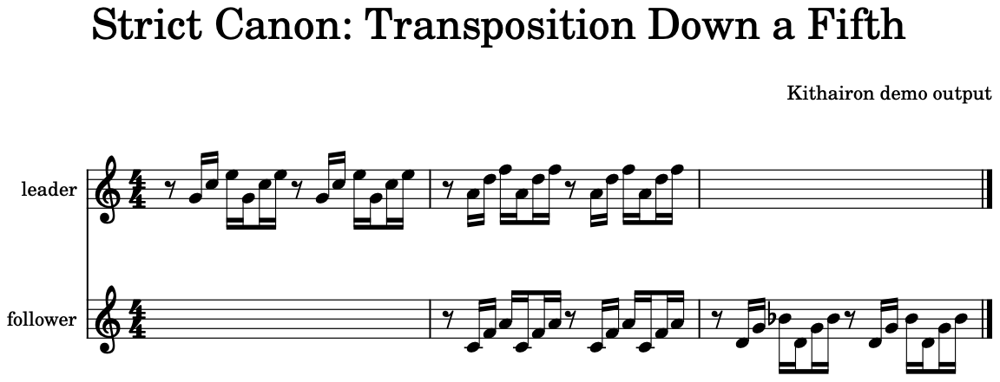
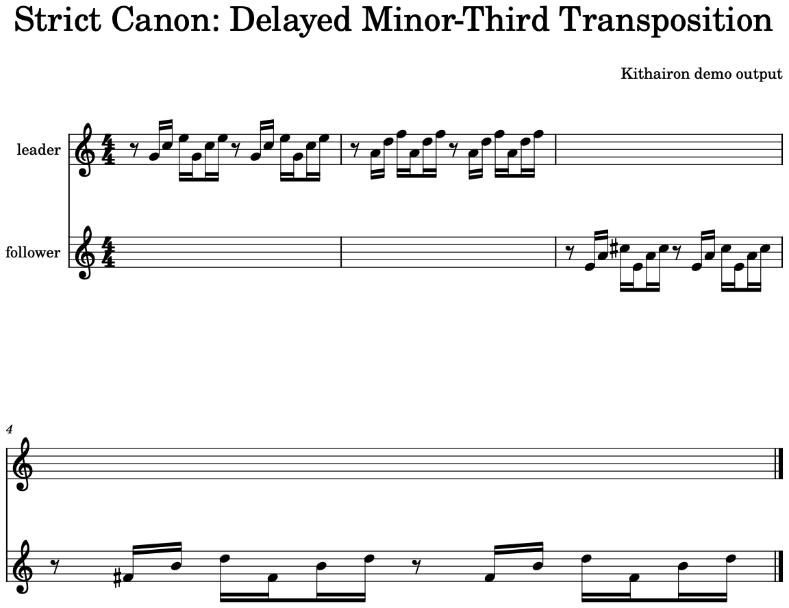

# Demo

This demo uses `examples/melodies/bach_wtc1_c_major_prelude_upper.musicxml`, a two-measure monophonic incipit derived from the public-domain BWV 846 entry shipped in the music21 corpus.

Run the same example locally:

```bash
uv run canonize generate examples/melodies/bach_wtc1_c_major_prelude_upper.musicxml \
  --out tmp/demo \
  --engine repair \
  --top-k 12
```

The selected preview is the rank 1 repair candidate from this run: repaired inversion, delay 4, score 86.0. In a listening pass over the retained demo candidates, it was the most pleasant clip even though a stricter transposition candidate scored higher under Kithairon's rule penalties.

## Input


## Selected Repair Candidate

<audio controls preload="metadata">
  <source src="../assets/demo/output-repair-inversion-delay4.mp3" type="audio/mpeg">
  <a href="../assets/demo/output-repair-inversion-delay4.mp3">Download the selected repair candidate MP3.</a>
</audio>


- [MusicXML](assets/demo/output-repair-inversion-delay4.musicxml)
- [MIDI](assets/demo/output-repair-inversion-delay4.mid)
- [MP3](assets/demo/output-repair-inversion-delay4.mp3)

The score breakdown shows why this relaxed candidate still pays weak-beat dissonance penalties under the current scoring model.


## Strict Comparison

The best strict fallback keeps the follower as an exact transposition transform with delay 4.

<audio controls preload="metadata">
  <source src="../assets/demo/output-strict-transposition-delay4.mp3" type="audio/mpeg">
  <a href="../assets/demo/output-strict-transposition-delay4.mp3">Download the strict transposition delay 4 MP3.</a>
</audio>



- [MusicXML](assets/demo/output-strict-transposition-delay4.musicxml)
- [MIDI](assets/demo/output-strict-transposition-delay4.mid)
- [MP3](assets/demo/output-strict-transposition-delay4.mp3)

The second retained strict candidate uses a wider delay.

<audio controls preload="metadata">
  <source src="../assets/demo/output-strict-transposition-delay8.mp3" type="audio/mpeg">
  <a href="../assets/demo/output-strict-transposition-delay8.mp3">Download the strict transposition delay 8 MP3.</a>
</audio>



- [MusicXML](assets/demo/output-strict-transposition-delay8.musicxml)
- [MIDI](assets/demo/output-strict-transposition-delay8.mid)
- [MP3](assets/demo/output-strict-transposition-delay8.mp3)

## Web View

Start the visualization API and frontend as described in [Visualization](visualization.md), then upload `examples/melodies/bach_wtc1_c_major_prelude_upper.musicxml`.


