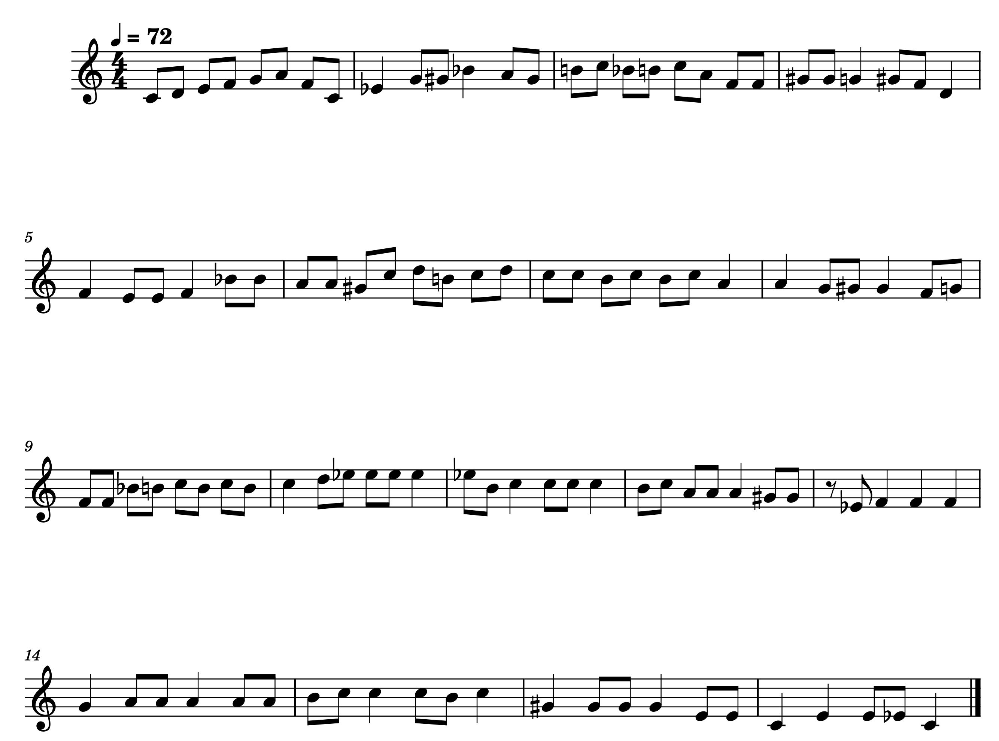
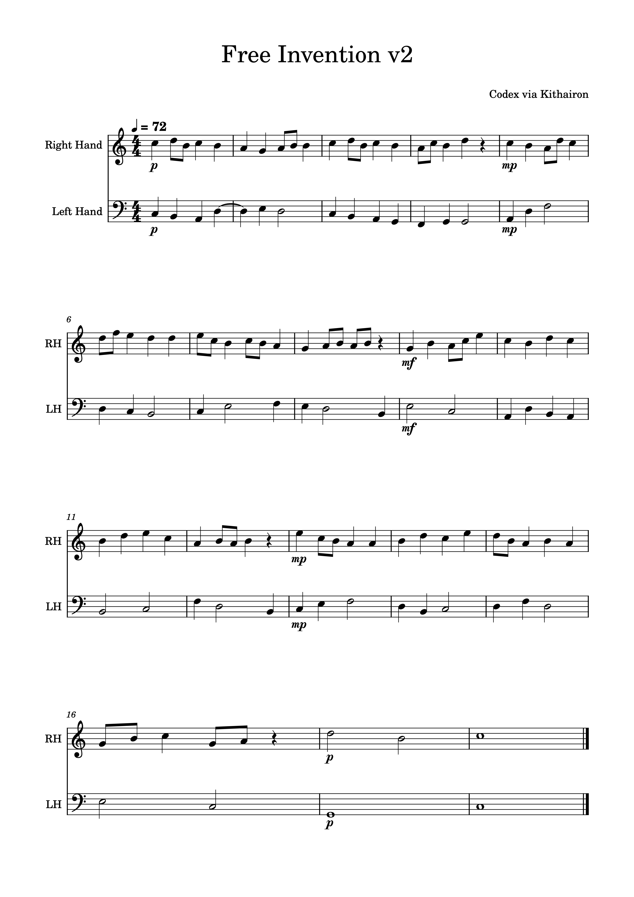

# Demo

This page shows a one-minute composition-assist case study. It starts from a short monophonic
theme and ends at a complete two-voice piece after local polish, fixed-voice rewrites, and
analysis-guided iteration.

This is not presented as a one-command strict or repair engine result. It is a preview of what
the current composition-assist workflow can be pushed toward when you keep iterating instead of
stopping at the first generated canon candidate.

## Source Theme

The seed melody is a short monophonic theme prepared for the browser workflow.

<audio controls preload="metadata">
  <source src="../assets/demo/one-minute-source-theme.mp3" type="audio/mpeg">
  <a href="../assets/demo/one-minute-source-theme.mp3">Download the source theme MP3.</a>
</audio>

- [MusicXML](assets/demo/one-minute-source-theme.musicxml)
- [MP3](assets/demo/one-minute-source-theme.mp3)

## Final One-Minute Piece

The finished score runs for 18 bars in 4/4 at 72 BPM, for exactly 60.0 seconds of score time.
The local counterpoint audit for this retained version ended at `100 / 100` with `0` rule
violations.

<audio controls preload="metadata">
  <source src="../assets/demo/one-minute-composition.mp3" type="audio/mpeg">
  <a href="../assets/demo/one-minute-composition.mp3">Download the one-minute composition MP3.</a>
</audio>

- [MusicXML](assets/demo/one-minute-composition.musicxml)
- [MIDI](assets/demo/one-minute-composition.mid)
- [MP3](assets/demo/one-minute-composition.mp3)

## What This Demo Shows

- Kithairon is still a canon-focused generator, but the browser workflow can keep refining a
  candidate past the first usable output.
- Fixed-voice invention is useful when the next improvement is in one line, not the whole texture.
- Analysis findings are most useful when they become editing actions, not just diagnostics.

See [Visualization](visualization.md) for the browser workflow that supports this style of
iteration, and see the repository README for direct CLI generation examples.
